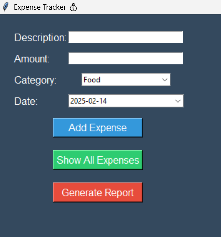
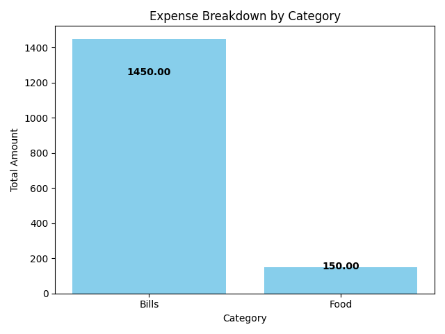

```markdown
# 💰 Expense Tracker Application

This is a desktop-based Expense Tracker built using **Tkinter** for the GUI, **Pandas** for data management, and **Matplotlib** for visualizations. It helps you track expenses by category and date, and generates insightful reports with expenses displayed inside the bars for better visualization. All expenses are saved locally using a CSV file, ensuring your data persists even after closing the app.

---

## 🚀 Features

- **Add Expense:** Add details like description, amount, category, and date.
- **View All Expenses:** Display all recorded expenses.
- **Expense Report:** Visualize expenses by category with amounts shown inside bars.
- **Local Storage:** Expenses are saved locally in `expenses.csv`.
- **Calendar Integration:** Date selection with a user-friendly calendar (using `tkcalendar`).

---

## 🖥️ Technologies Used

- **Python** 
- **Tkinter** - GUI framework
- **Pandas** - Data manipulation and storage
- **Matplotlib** - Data visualization
- **tkcalendar** - Calendar widget for date selection

---

## 📦 Installation

### Prerequisites:
- Ensure you have Python installed. [Download Python](https://www.python.org/downloads/)

### Install Required Libraries:
```bash
pip install pandas matplotlib tkcalendar
```

### Clone the Repository:
```bash
git clone https://github.com/Shiva0909122/python-project-class.git
cd python-project-class
```

---

## 🔧 Usage

1. Run the application:
```bash
python expense_tracker.py
```

2. **Add Expense:** Enter description, amount, select category, and choose date from the calendar.  
3. **View Expenses:** Click on "Show All Expenses" to see the list of all recorded expenses.  
4. **Generate Report:** Click on "Generate Report" to see expense breakdown by category.  

---

## 📊 Data Storage

All expenses are stored locally in `expenses.csv` which is created automatically in the project directory. It ensures data persistence, so your expenses are available even after restarting the app.

---

## 🎨 UI/UX Enhancements

- Modern, clean, and intuitive UI with a dark theme.
- Calendar widget for easy date selection.
- Amounts displayed inside bars for better data visualization.

---

## 🛠️ Deployment

1. **Create a new repository on GitHub**.
2. Initialize Git in your project directory:
    ```bash
    git init
    git add .
    git commit -m "Initial commit"
    ```
3. **Link to GitHub Repository**:
    ```bash
    git remote add origin https://github.com/Shiva0909122/python-project-class.git
    git push -u origin main
    ```

---

## 📸 Screenshots

| Add Expense | Expense Report |
|-------------|----------------|
|  |  |

---

## 🤝 Contributing

1. Fork the repository.
2. Create your feature branch: `git checkout -b feature/AmazingFeature`
3. Commit your changes: `git commit -m 'Add some AmazingFeature'`
4. Push to the branch: `git push origin feature/AmazingFeature`
5. Open a pull request.

---


## 📞 Contact

- **Your Name**: [Your Email](mailto:shivarth.drona@gmail.com)
- **GitHub**: [https://github.com/your-username](https://github.com/shiva0909122)

---

## ⭐ Acknowledgments

- Inspired by the need to track personal expenses efficiently.
- Special thanks to the developers of Tkinter, Pandas, and Matplotlib for their amazing libraries.

---

## 🔗 Links

- [Python Documentation](https://docs.python.org/3/)
- [Tkinter Documentation](https://docs.python.org/3/library/tkinter.html)
- [Pandas Documentation](https://pandas.pydata.org/docs/)
- [Matplotlib Documentation](https://matplotlib.org/stable/contents.html)
- [tkcalendar Documentation](https://github.com/j4321/tkcalendar)

---
